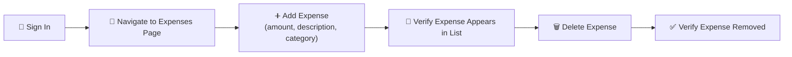

<p align="center">
  
</p>

<p align="center">
  
  
  
</p>

---

### 📋 Overview

This project automates the key user flows of a live, deployed app — the **[Nest.js Expense Tracker](https://nest-js-expense-tracker.vercel.app/)** — covering authentication and expense management (create/delete), to verify the app behaves correctly from a real end user's perspective.

> 🆕 **New to this repo, or new to Playwright entirely?** This README is written so you don't need prior context — every section below explains not just *what* exists, but *what it means* and *why it's there*.

---

### 🧰 Tech Stack

<p align="center">
  
</p>

| Tool | What it is | Why it's used here |
|---|---|---|
| 🎭 **[Playwright](https://playwright.dev/)** | A browser-automation framework — it drives a real browser (clicks, types, navigates) and asserts what should be on screen | Runs every test in this repo, end to end |
| 🔷 **TypeScript** | JavaScript with type-checking added on top | Catches mistakes (like a typo'd selector) before the test even runs |
| 🟩 **Node.js** | The JavaScript runtime that executes everything outside a browser | Required to install and run Playwright at all |

---

### 🔄 What the Tests Actually Do



Each of the numbered steps above corresponds to real assertions in the test files — Playwright doesn't just click through the app, it checks at each step that the app actually did what it was supposed to.

---

### 📁 Project Structure

```
Expense-Tracker-Automation-Playwright-
├── tests/
│   ├── Signin.spec.ts                       # Sign-in flow test
│   ├── Signin_Expenses.spec.ts              # Sign-in + navigate to Expenses page
│   ├── Addexpense_deleteexpense_test.spec.ts # Create and delete an expense
│   ├── 01_Test.spec.ts                      # (empty / placeholder)
│   └── example.spec.ts                      # Default Playwright sample test
├── playwright.config.ts                     # Playwright configuration
├── package.json                             # Project dependencies
├── package-lock.json
└── .gitignore
```

> 💡 **New to Playwright projects?** A "spec" file (short for *specification*) is just a file containing one or more tests — `.spec.ts` is the naming convention Playwright looks for automatically when you run `npx playwright test`.

---

### ✅ Test Coverage — Step by Step

<details open>
<summary><b>🔑 <code>Signin.spec.ts</code> — Sign-in flow</summary>
<br>

**What it does:** Logs into the Expense Tracker application with valid credentials.

**Step by step:**
1. Opens the app's login page in a browser
2. Fills in the email/username field
3. Fills in the password field
4. Clicks the sign-in button
5. Asserts the app successfully lands on the logged-in view (confirming the credentials were accepted)

</details>

<details>
<summary><b>🧾 <code>Signin_Expenses.spec.ts</code> — Sign-in + navigation</summary>
<br>

**What it does:** Signs in (same as above), then navigates to the Expenses page.

**Step by step:**
1. Repeats the sign-in flow
2. Clicks/navigates to the "Expenses" section of the app
3. Asserts the Expenses page has actually loaded (e.g. the right heading or URL is present)

**Why this is a separate test from `Signin.spec.ts`:** it isolates *navigation* as its own thing to verify, so if this test fails, you know the problem is with getting to the Expenses page specifically — not with logging in.

</details>

<details>
<summary><b>➕ <code>Addexpense_deleteexpense_test.spec.ts</code> — Create & delete an expense</summary>
<br>

**What it does:** The most complete end-to-end flow in this repo — signs in, adds a new expense, verifies it, then deletes it.

**Step by step:**
1. Signs in
2. Navigates to the Expenses page
3. Opens the "add expense" form
4. Fills in the **amount** field
5. Fills in the **description** field
6. Selects a **category**
7. Submits the form
8. Asserts the new expense now appears in the expense list
9. Deletes that same expense from the list
10. Asserts the expense is gone from the list

**Why it matters:** this test leaves the app in the same state it found it in — it doesn't add test data that lingers behind, which is good practice for a suite that runs against a live app.

</details>

<details>
<summary><b>🧪 <code>example.spec.ts</code> — Default Playwright starter test</summary>
<br>

**What it does:** Validates the title and navigation of playwright.dev itself. This is the sample test Playwright auto-generates when you first scaffold a project (`npm init playwright@latest`) — it's not testing the Expense Tracker app at all.

**Why it's still here:** most people leave it in early on, either as a reference for Playwright syntax or because it's easy to forget about. See the Notes section below.

</details>

<details>
<summary><b>📄 <code>01_Test.spec.ts</code> — Empty placeholder</summary>
<br>

**What it does:** Nothing yet — it's an empty file, likely scaffolded as a starting point for a future test.

</details>

---

### ⚙️ Configuration Highlights

<details>
<summary><b>playwright.config.ts settings — click to expand, with plain-English explanations</b></summary>
<br>

| Setting | Value | What this means in practice |
|---|---|---|
| Test directory | `./tests` | Playwright only looks inside this folder for `.spec.ts` files to run |
| Browser | Chromium (Desktop Chrome) | Tests run in a Chrome-based browser engine, not Firefox or Safari |
| Headless mode | ❌ Disabled | A real, visible browser window pops up while tests run — you can watch it click through the app live |
| Trace | ✅ Enabled | Playwright records a full timeline (DOM snapshots, network, actions) for every run, viewable later with `npx playwright show-trace` |
| Screenshots | ✅ Enabled (full page) | A screenshot is saved automatically, useful for seeing exactly what the page looked like at test end |
| Video | ✅ Enabled | A full video recording of the browser session is saved for every run |
| Slow motion | 1000ms delay between actions | Each action (click, type) is artificially slowed by 1 second, purely to make the browser easier to watch/debug with the naked eye |
| Timeout | 60 seconds per test | If a test hasn't finished within 60 seconds, Playwright marks it as failed rather than hanging forever |
| Reporter | HTML report | After a run, results are compiled into a browsable HTML report instead of just console text |

</details>

---

### 🚀 Getting Started (Complete Beginner Walkthrough)

**Prerequisites:**
- [Node.js](https://nodejs.org/) (LTS recommended) — this installs both Node and `npm` together
- A code editor like VS Code (optional but recommended)

<details open>
<summary><b>Step-by-step setup — click to expand</b></summary>
<br>

**1. Clone the repository**
```bash
git clone https://github.com/vamsimappetti2001/Expense-Tracker-Automation-Playwright-.git
cd Expense-Tracker-Automation-Playwright-
```
*This downloads the project to your computer and moves your terminal into that folder.*

**2. Install dependencies**
```bash
npm install
```
*This reads `package.json` and downloads every library the project needs (including Playwright itself) into a `node_modules/` folder.*

**3. Install Playwright's browsers**
```bash
npx playwright install
```
*Playwright needs its own browser binaries (separate from any browser already on your computer) to run tests reliably — this step downloads them. It only needs to be done once per machine.*

</details>

### ▶️ Running Tests

```bash
# Run every test in the suite
npx playwright test

# Run just one file
npx playwright test tests/Signin.spec.ts

# Run tests with Playwright's interactive UI (great for beginners — shows each step visually)
npx playwright test --ui

# View the HTML report generated from the last run
npx playwright show-report
```

> 💡 **First time running tests?** Start with `npx playwright test --ui` — it opens an interactive window where you can watch each test step through the app, rerun individual tests, and see exactly where something failed, without reading raw terminal output.

---

### 🆘 Troubleshooting (Common First-Run Issues)

<details>
<summary><b>Click to expand common problems and fixes</b></summary>
<br>

| Problem | Likely Cause | Fix |
|---|---|---|
| `npx: command not found` | Node.js isn't installed | Install Node.js from [nodejs.org](https://nodejs.org/), then reopen your terminal |
| Browser fails to launch / "Executable doesn't exist" | Playwright's browsers weren't installed | Run `npx playwright install` |
| Sign-in test fails immediately | The hardcoded test credentials are invalid or the account changed | See the Security Note below — credentials should be moved to `.env` |
| Tests time out on a live site | The deployed app (`nest-js-expense-tracker.vercel.app`) is slow to respond or down | Re-run the test; if it persists, check the site loads normally in a regular browser first |
| Nothing happens / browser window doesn't appear | Headless mode may have been toggled on somewhere | Check `playwright.config.ts` — `headless` should be `false` for a visible browser |

</details>

---

### 🔐 Security Note — Action Required Before This Repo Is Public-Facing

> ⚠️ The current test files contain **hardcoded login credentials** directly in the test scripts.

Before sharing or continuing to use this repository publicly:
- [ ] Move credentials to environment variables via a `.env` file (already excluded in `.gitignore`) and load them with `dotenv` (already scaffolded, commented out, in `playwright.config.ts`)
- [ ] Rotate the exposed password on the target account
- [ ] Consider rewriting git history if the credentials should never have been public — a `git filter-repo` or GitHub's secret-removal guide can help with this

---

### 📌 Notes

- `01_Test.spec.ts` is currently empty and can be removed or filled in with additional test cases
- `example.spec.ts` is the default test Playwright scaffolds on setup — safe to delete once you're confident in your own custom tests, but harmless to leave as a reference

---

### 📖 Glossary (For Anyone New to Playwright)

<details>
<summary><b>Click to expand</b></summary>
<br>

| Term | Meaning |
|---|---|
| **E2E (End-to-End) test** | A test that drives the app the way a real user would — clicking, typing, navigating — rather than testing one function in isolation |
| **Spec file** | A file containing one or more tests, conventionally named `*.spec.ts` |
| **Headless** | Running a browser with no visible window (faster, used in CI); the opposite of what this repo uses |
| **Trace** | A recorded timeline of everything Playwright did during a test — DOM state, network calls, screenshots — viewable after the fact |
| **Locator** | Playwright's way of finding an element on the page (e.g. by text, role, or test ID) before interacting with it |
| **Assertion** | A check that something is true (e.g. "this text is visible") — if it's false, the test fails |
| **Reporter** | The format Playwright uses to show you results after a run (e.g. HTML report, console list) |

</details>

---

### 👤 Author

**Vamsi Mappetti** · QA / Test Automation Engineer
📍 Bengaluru, India &nbsp;|&nbsp; 🔗 [@vamsimappetti2001](https://github.com/vamsimappetti2001)


